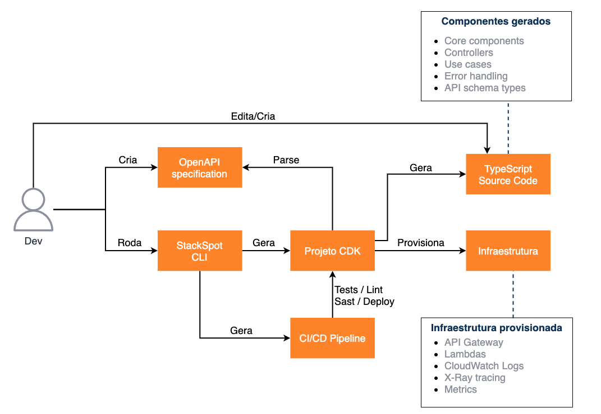
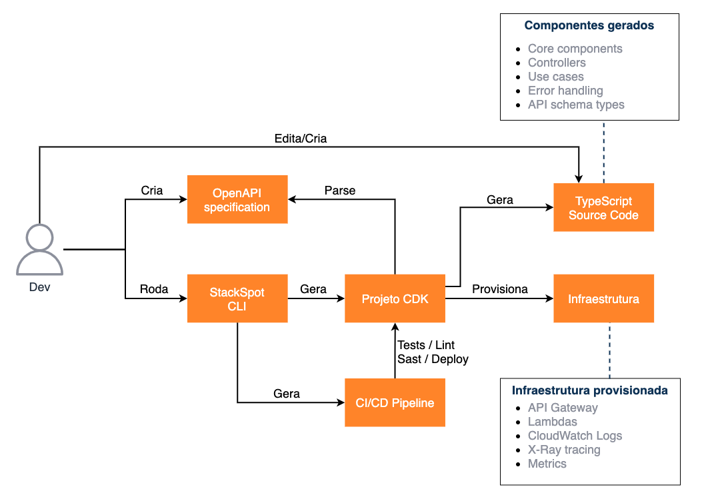

## Developer workflow overview

1. Developer creates an OpenAPI spec using his favorite tools
2. Developer runs StackSpot cli or cdk init to create CDK project (when cdk init is used is necessary to import and initialize the StackSpotOpenAPIServices construct in project stack)
3. Developer runs cdk synth to generate boilerplate code for endpoints controllers and usecases implementation.
4. Developer edits/creates typescript source code generated to implement usecases
5. Develop run cdk deploy or commit the code to run CI/CD pipeline and all infrastructure needed to provide the defined services is created as a Cloudformation Stack in AWS Account.

## Generated source code

The generated source code is organized in a layered archicture with some basic components: **Core components, API Schemas and Errors, Parameters Configurations, Operation Controllers and Operation Use Cases.**

### Core components (src/core/\*\*/\*.ts)

- Core components are responsible to provide utilities and base classes for other components.

- You can create you own files in core components but the files created by the CDK Construction are overwrited when a cdk command is runned by the user. **DON'T** change the core generated files or your changes **WILL BE LOST**.

- You can customize the base components like Controller extending them and adding/changing behaviours as you need.

- The base classes provides some template methods to customize their behaviour in subclasses.

### API schemas (src/api-schemas.ts and src/error.ts)

- All schemas defined in [OpenAPI components section](https://swagger.io/specification/#components-object) are parsed and represented as typescript interfaces in `src/api-schemas.ts.
- All changes made to the schemas are reflected to this file when use execute cdk synth and the file is overwrited, so **DON'T** change this file or your changes **WILL BE LOST**.
- The construct also create an error structure that is used as base class for errors in api.
- All responses of api operations that are not 2xx response codes generates an Error subclass representing this return code. When you need to return this response to user you can throw the corresponding error and the controller will convert the response accordingly.

### Parameters configuration (src/\<operationId\>/parameters-configuration.json)
- All operations defined in [OpenAPI operations objects](https://swagger.io/specification/#operation-object) generates a JSON file with the parameters defined by the operation.
- The operation controller uses this configuration to know how to parse the parameters from API Gateway event and convert them to API schema objects and parameters to operation use case responsible to process the request.
- Parameters configurations are overwrited every time the user execute a cdk command so **DON'T** change this file or your changes **WILL BE LOST**.
- There are some known limitations in parameters definitions in your OpenAPI spec:
  - `cookie` parameters are not supported.
  - `arrays` are not supported in path or header parameters.
  - parameters can be only primitive types `object` parameters are not supported.
  - `style` an `explode` parameters modifiers are not supported.
  - parameters cannot be `arrays` of `arrays`.
### Operation controllers (src/\<operationId\>/controller.ts)
- Controllers are responsible to convert API Gateway event to parameters and API schemas representations a to execute use cases with the parameters already converted.
- They also can be responsible to validate resource access using an use case and throwing AccessDeniedError when necessary.
- Controllers have some template methods that can be use to customize their behaviour:
  - `buildUseCaseArgs` can be ovewrited to customize use case arguments when needed.
  - `transformUseCaseResponse` can be overwrited to transform use case response before converting it to success response.
  - `convertResponseToApiGatewayResponse` can be overwrited to customize the response creation. A common usecase is to return binary data instead of JSON.
- Controllers are generated when user executes a cdk command but don't ovewrite already generated controllers, so you can safelly modify controllers source code as you need.

### Operation use cases (src/\<operationId\>/usecase.ts)
- Use cases are responsible to implement the business rules of API.
- We recomend to isolate database interactions in repositories to abstract database acesss.
- Error codes represented by operation responses are generated as error classes in usecase file and this errors can be throw to generate the non success response of API.
- The requestBody when exists is converted by controllers and received as use case parameter.
- When JWT authentication is enabled `jwtTokenPayload` is passed as parameter for use case so they can do security assertions.
- Use cases are generated when user executes a cdk command but don't ovewrite already generated use cases, so you can safelly modify use case source code as you need.

## Generated Infrastucture

- The CDK construct generates the following components in the stack:
  - API gateway with all operations defined in spec
  - One lambda per operation defined
  - Cloudwatch logs of lambdas
  - Enables X-Ray for api gateway and generated lambdas
  - Adjust lambda permissions to be invoked by api gateway
